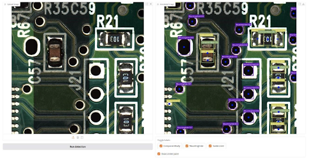

# PCBInspect-AI

**Automated PCB Feature Detection for AOI Recipe Generation**


A deep learning platform for automated Printed Circuit Board (PCB) inspection. It replaces the manual process of teaching Automated Optical Inspection (AOI) systems by using a two-stage pipeline - semantic segmentation followed by object detection - to extract structural PCB features such as component bodies, leads, and solder joints.



---

## Architecture

```
PCB Image
    │
    ▼
┌─────────────────────────────────┐
│  Stage 1: Semantic Segmentation │  DeepLabV3 (ResNet-50) + Transformer Decoder
│  Classes: Component Body,        │  Pixel Accuracy > 97.5%
│           Lead, Solder Paste     │
└──────────────┬──────────────────┘
               │
               ▼
┌─────────────────────────────────┐
│  Stage 2: Feature Detection     │  YOLOv12 / RF-DETR / RT-DETR
│  Output: Bounding Boxes,        │  SAHI for full-board inference
│          Confidence Scores      │
└──────────────┬──────────────────┘
               │
               ▼
        JSON Export + Gradio UI
```

---

## Models & Results

| Model | mAP@0.5 | Recall | Training Speed | Recommended |
|---|---|---|---|---|
| YOLOv12 (fine-tuned) | **0.839** | **0.779** | 10-15 sec/epoch | ✅ |
| RT-DETR Large | 0.825 | 0.772 | - | Evaluated, narrowed down |
| RF-DETR (DINOv2) | 0.77 | 0.70 | 3-10 min/epoch | - |
| Hybrid ConvXGB | 0.718 | - | - | - |

YOLOv12 is recommended for deployment due to superior recall (critical for minimizing missed defects) and significantly faster training. RT-DETR was evaluated during model selection but was narrowed down in favour of YOLOv12.

---

## Model Weights

Weights are hosted on Hugging Face: [JcProg/PCBInspect-AI](https://huggingface.co/JcProg/PCBInspect-AI)

| File | Model | Epochs |
|---|---|---|
| `YoloV12-Medium-160-FineTuned.pt` | YOLOv12 Medium (Recommended) | 160 (100 + 60) |
| `RFDETR-Medium-100-Epoch.pth` | RF-DETR Medium | 100 |

### Download

```bash
huggingface-cli download JcProg/PCBInspect-AI --local-dir demo/checkpoint/
```

Place downloaded files inside `demo/checkpoint/`.

---

## Installation

### Prerequisites

- Python 3.10.11
- CUDA-capable GPU recommended (CUDA 12.1)

### 1. Clone the repo

```bash
git clone https://github.com/JC-prog/pcb-inspect-ai.git
cd pcb-inspect-ai
```

### 2. Change into the demo directory

```bash
cd demo
```

### 3. Create and activate a virtual environment

```bash
python -m venv venv
```

Windows:
```bash
venv\Scripts\Activate.ps1
```

Mac / Linux:
```bash
source venv/bin/activate
```

### 4. Install dependencies

```bash
pip install -r requirements.txt
```

### 5. Install PyTorch

Choose based on your hardware:

**CPU only:**
```bash
pip install torch torchvision torchaudio --index-url https://download.pytorch.org/whl/cpu
```

**GPU (CUDA 12.1):**
```bash
pip install torch torchvision torchaudio --index-url https://download.pytorch.org/whl/cu121
```

---

## Usage

### Launch the Gradio app

```bash
python app.py
```

Open [http://localhost:7860](http://localhost:7860) in your browser.

### Inference tab

1. Upload a PCB image
2. Click **Run Detection**
3. View annotated output with bounding boxes
4. Toggle label visibility and center points
5. Export results as JSON (bounding box coordinates + confidence scores)

### Model tab

1. Select a backend: **YOLO**, **RT-DETR**, or **RF-DETR**
2. Load a checkpoint file (`.pt` or `.pth`) from `demo/checkpoint/`
3. Adjust the confidence threshold slider
4. Check model status before running inference

---

## Project Structure

```
PCBInspect/
├── demo/
│   ├── app.py                  # Gradio web application
│   ├── requirements.txt        # Python dependencies
│   ├── checkpoint/             # Model weights (download from HuggingFace)
│   ├── inference/
│   │   ├── base.py             # BaseDetector abstract class
│   │   ├── yolo_detector.py    # YOLOv12 detector
│   │   ├── rtdetr_detector.py  # RT-DETR detector
│   │   └── rfdetr_detector.py  # RF-DETR detector
│   └── utils/
│       └── drawing.py          # Bounding box annotation utilities
├── docs/
│   ├── PROJECT-SUMMARY.md      # High-level project overview
│   └── METHODLOLOGY.md         # Detailed methodology & training strategy
└── notebooks/                  # Training & evaluation notebooks
```

---

## Tech Stack

- **Detection:** Ultralytics (YOLOv12, RT-DETR), Roboflow (RF-DETR)
- **Inference:** SAHI (Slicing Aided Hyper Inference) for full-board tiling
- **Interface:** Gradio
- **Vision:** PyTorch, OpenCV, Pillow, timm, Transformers
- **Deployment:** ONNX

---

## Documentation

- [Project Summary](docs/PROJECT-SUMMARY.md) - goals, results, and recommendations
- [Methodology](docs/METHODLOLOGY.md) - data pipeline, architectures, training strategy
- [Results](docs/RESULTS.md) - model comparison and error analysis

### External Resources (Google Drive)

| Resource | Description |
|---|---|
| [Notebooks](https://drive.google.com/drive/folders/1NyMsRoG8B0-0Lr4z5CQLzR7OEahkka5K?usp=drive_link) | Jupyter notebooks used for training and evaluation |
| [Documents](https://drive.google.com/drive/folders/1HRaflPGTkw3rStWkGf34jQPuOSwSPxlB?usp=drive_link) | Project report and presentation slides |
| [Results](https://drive.google.com/drive/folders/1J42Y-g45l39aNU7A1RTcykD50LP98LFx?usp=drive_link) | Training outputs, logs, and exported weights |
| [Model Card](https://huggingface.co/JcProg/PCBInspect-AI/tree/main) | Hugging Face model card and weights |

---

## Authors

Developed at the **National University of Singapore (NUS)** as part of research into automated AOI recipe generation for semiconductor manufacturing.

<!-- Add authors below -->
| Name | Email |
|---|---|
| Jeffrey Chong Loh Loy Fatt | e1503303@u.nus.edu |
| Kenny Lau Jia Xu | e0271067@u.nus.edu |
| Wang Ze Yu | e1512194@u.nus.edu |
| Ye Htut | e1509815@u.nus.edu |

